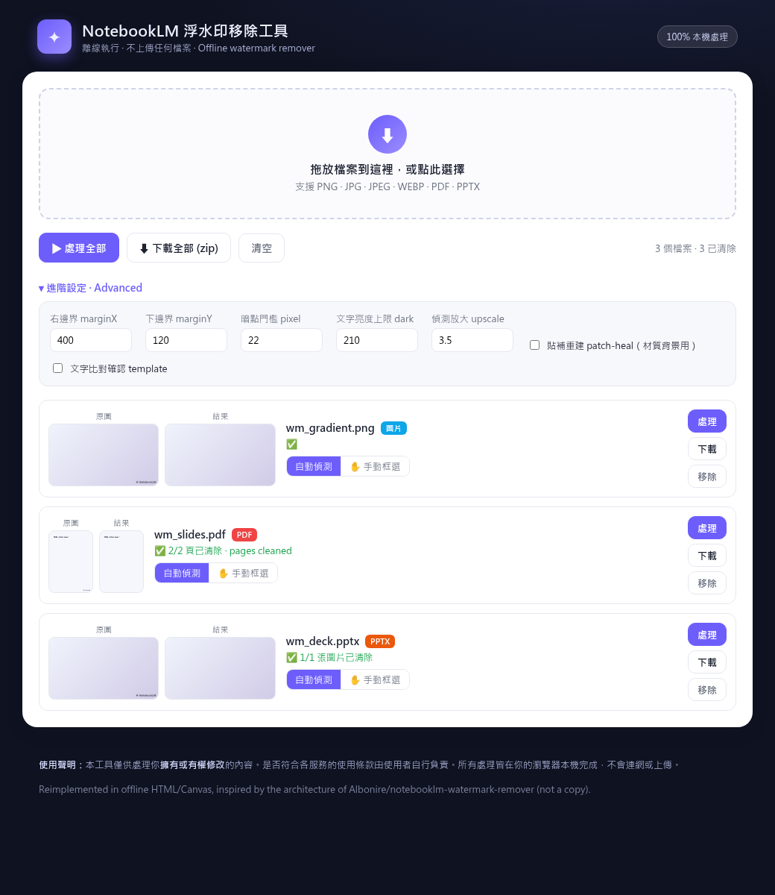

# NotebookLM 浮水印移除工具（離線 HTML 版）

把 NotebookLM 匯出的 **圖片 / PDF / PPTX** 右下角「NotebookLM」浮水印清除掉，
**完全離線、在你的瀏覽器本機執行**，不連網、不上傳任何檔案。

架構參考自 [`Albonire/notebooklm-watermark-remover`](https://github.com/Albonire/notebooklm-watermark-remover)
（Python + OpenCV CLI），但這裡是**用 HTML/Canvas 重新實作**，不是移植照抄。



## 怎麼用

直接用瀏覽器（Chrome / Edge / Firefox 等）**雙擊開啟**：

```
dist/notebooklm-watermark-remover.html
```

不需要伺服器、不需要安裝任何東西。把檔案拖進去、按「處理全部」、再下載即可。

- 支援格式：`PNG` `JPG` `JPEG` `WEBP` `PDF` `PPTX`
- 批次處理：一次拖多個檔案，可「下載全部 (zip)」
- **自動偵測**：自動找出右下角浮水印並重建背景
- **手動框選**：自動沒抓準時，切到「✋ 手動框選」用矩形/筆刷標出浮水印再重建
  （同一組標記會套用到圖片，或 PDF/PPTX 的每一頁／每張圖）
- 進階設定：可調右/下邊界、暗點門檻、放大倍率，並切換 `patch-heal`（材質背景用）

## 移除原理（重新實作的重點）

1. 取右下角 ROI，轉灰階，用區域背景估計（box blur）找「淺底上的深色像素」。
2. 連通元件 + 面積／緊緻度過濾，挑出浮水印筆畫；**填補封閉孔洞**（實心 icon、字母內孔）。
3. 重建背景：預設用**鄰近線性內插 inpaint**（對 NotebookLM 的漸層／純色背景無縫），
   材質背景可改用 `patch-heal`（複製鄰近乾淨區塊）。
4. PDF：渲染「較寬鬆的右下角」做偵測與重建（背景充足、結果乾淨），
   再用 pdf-lib **只把浮水印那一小塊**貼回頁面，其餘內容原封不動。
5. PPTX：當成 zip 解開，清掉 `ppt/media/*` 裡的圖片再打包回去。

## 從原始碼重建單一檔案

成品是由 `src/`（我的程式）+ `vendor/`（第三方 UMD 函式庫）組合而成的單一 HTML。
只要有 Python 3：

```bash
python3 build.py        # 產生 dist/notebooklm-watermark-remover.html
```

`vendor/` 已內含所需函式庫。若要重新下載（皆為 **legacy UMD** 版，才能在 `file://` 用）：

```bash
cd vendor
curl -fsSLO https://cdn.jsdelivr.net/npm/jszip@3.10.1/dist/jszip.min.js
curl -fsSLO https://cdn.jsdelivr.net/npm/pdf-lib@1.17.1/dist/pdf-lib.min.js
curl -fsSL  -o pdf.min.js        https://cdn.jsdelivr.net/npm/pdfjs-dist@3.11.174/legacy/build/pdf.min.js
curl -fsSL  -o pdf.worker.min.js https://cdn.jsdelivr.net/npm/pdfjs-dist@3.11.174/legacy/build/pdf.worker.min.js
```

pdf.js 的 worker 會被 `build.py` 以 base64 內嵌，執行時轉成 Blob URL，所以**零外部檔案**。

## 開發者驗證（選用）

`test_fixtures/verify.js` 用無頭 Chrome 跑完整流程（圖片/PDF/PPTX/手動），需要本機 Chrome：

```bash
npm install puppeteer-core      # 不會下載 Chromium，使用系統 Chrome
node test_fixtures/verify.js    # 預期最後印出 RESULT PASS
```

## 已知限制

- 自動偵測針對 NotebookLM 標準的「右下角」浮水印調校；非典型版面請用手動框選。
- PDF 採「貼上修補圖」的方式（與參考專案相同）：浮水印**視覺上**被蓋掉，但
  原 PDF 文字圖層裡可能仍含 "NotebookLM" 字串（複製/搜尋仍可能找到）。
- 大型 PDF 會逐頁渲染，頁數很多時需要一些時間與記憶體。

## 使用聲明

本工具僅供處理你**擁有或有權修改**的內容。是否符合各服務的使用條款由使用者自行負責。
所有處理皆在你的瀏覽器本機完成，不會連網或上傳。
